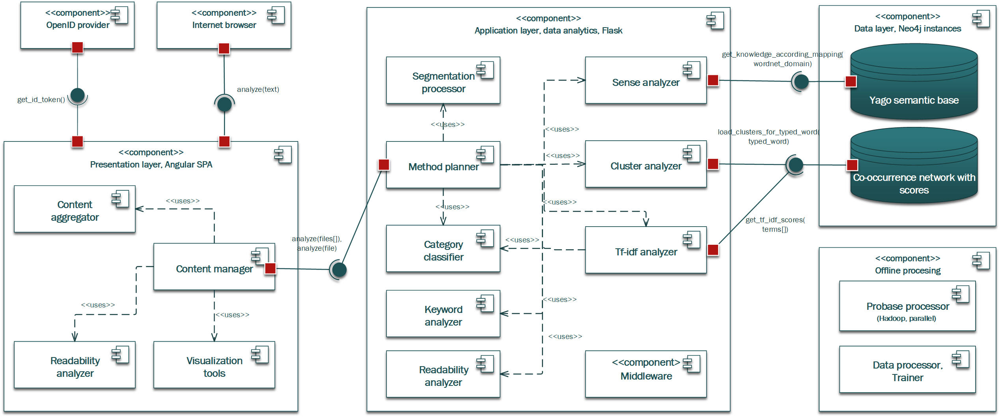
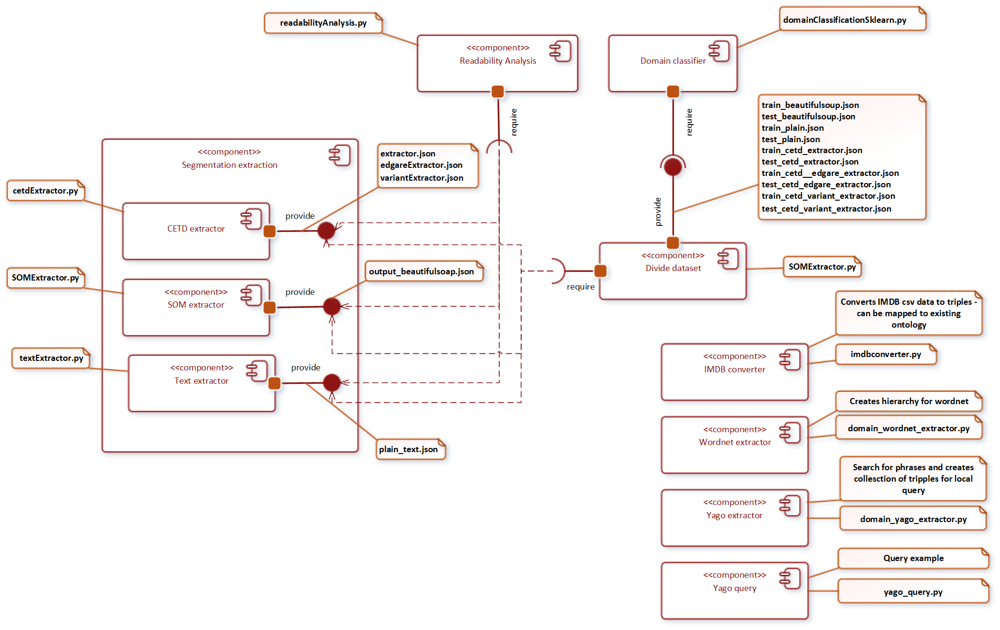

Repository for master thesis with orientation to semantic aspects of web documents

# Architecture for automatization of semantic analysis - REST API (in development)

# Run with Docker

1.    Download docker-compose.yml file from project repository to created directory (can be empty).
   https://github.com/jperdek/semanticAnalysis/blob/master/docker-compose.yml
3.    Move to this folder using command line:  
  `cd C://path/to/docker-compose.yml`
3.    Pulling docker images from Docker Hub by executing command:  
  `docker-compose pull`
4.    Launching images by executing folowing command:  
  `docker-compose up --no-build`
5.    Open following page in browser:  
  `http://localhost:4200/automatization`
6.    Inserting text (txt or html formats are supported) and clicking on the button with name Analyze
7.    Waiting for response and clicking on new tab with arrived results from response. For the first time loading is slower.

# Run services using deployment uwsgi nginx with docker  

## Run  
`docker run -p 5000:5000 jperdek/semantic-aspects-app-nginx`  

## Possible to build again 
`docker build -f DockerfileNginx -t jperdek/semantic-aspects-app-nginx .`

# Architecture before recreation using REST API
Repository for master thesis with orientation to semantic aspects of web documents

